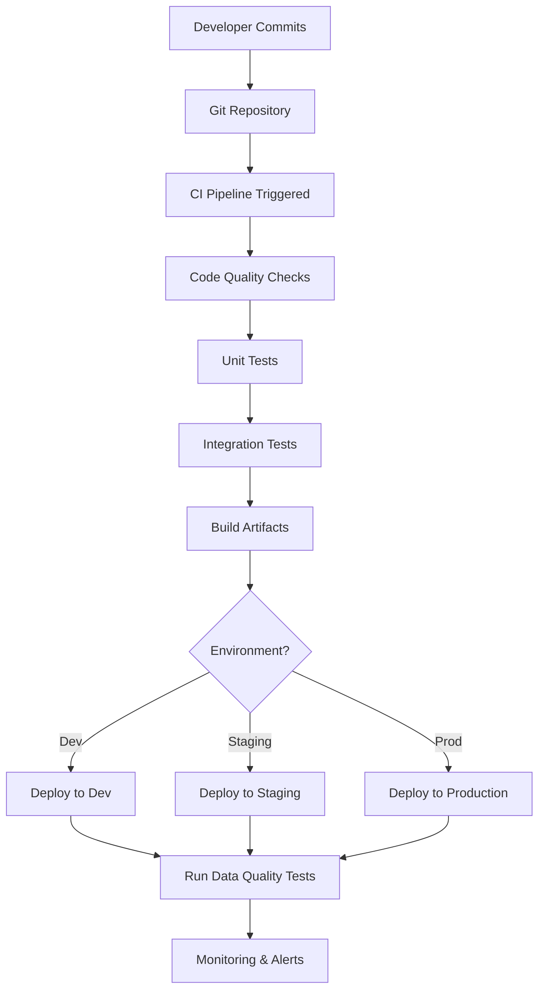

# CI/CD Integration for Hiscox ETL Pipeline

## Overview

This document outlines a comprehensive CI/CD strategy for the Hiscox ETL pipeline using Azure DevOps, GitHub Actions, and infrastructure automation. The pipeline ensures reliable, automated deployment of data engineering workloads across multiple environments.

## Architecture Overview



## 1. Repository Structure for CI/CD

```
etl-hiscox/
├── .github/workflows/          # GitHub Actions workflows
│   ├── ci.yml                 # Continuous Integration
│   ├── cd-dev.yml             # Deploy to Dev
│   ├── cd-staging.yml         # Deploy to Staging
│   └── cd-production.yml      # Deploy to Production
├── .azure-pipelines/          # Azure DevOps pipelines
│   ├── ci-pipeline.yml
│   └── cd-pipeline.yml
├── terraform/
│   ├── environments/          # Environment-specific configs
│   │   ├── dev/
│   │   ├── staging/
│   │   └── production/
│   └── modules/               # Reusable Terraform modules
├── scripts/
├── dbt/
├── tests/                     # All test files
│   ├── unit/
│   ├── integration/
│   └── data_quality/
├── docker/                    # Container definitions
├── deployment/                # Deployment scripts
└── monitoring/               # Monitoring configurations
```

## 2. CI/CD Pipeline Stages

### Stage 1: Continuous Integration (CI)

#### Code Quality & Security
```yaml
# .github/workflows/ci.yml
name: Continuous Integration

on:
  push:
    branches: [ main, develop, feature/* ]
  pull_request:
    branches: [ main, develop ]

jobs:
  code-quality:
    runs-on: ubuntu-latest
    steps:
      - uses: actions/checkout@v4
      
      - name: Set up Python
        uses: actions/setup-python@v4
        with:
          python-version: '3.12'
          
      - name: Install dependencies
        run: |
          pip install -r requirements.txt
          pip install -r requirements-dev.txt
          
      - name: Code formatting check
        run: black --check .
        
      - name: Linting
        run: flake8 .
        
      - name: Type checking
        run: mypy scripts/
        
      - name: Security scan
        run: bandit -r scripts/
        
      - name: Dependency vulnerability check
        run: safety check
```

#### Unit Testing
```yaml
  unit-tests:
    runs-on: ubuntu-latest
    steps:
      - uses: actions/checkout@v4
      
      - name: Set up Python
        uses: actions/setup-python@v4
        with:
          python-version: '3.12'
          
      - name: Install dependencies
        run: pip install -r requirements.txt
        
      - name: Run unit tests
        run: |
          pytest tests/unit/ \
            --cov=scripts \
            --cov-report=xml \
            --cov-report=html \
            --junit-xml=test-results.xml
            
      - name: Upload coverage reports
        uses: codecov/codecov-action@v3
        with:
          file: ./coverage.xml
```

#### dbt Testing
```yaml
  dbt-tests:
    runs-on: ubuntu-latest
    services:
      postgres:
        image: postgres:13
        env:
          POSTGRES_PASSWORD: postgres
        options: >-
          --health-cmd pg_isready
          --health-interval 10s
          --health-timeout 5s
          --health-retries 5
    steps:
      - uses: actions/checkout@v4
      
      - name: Set up Python
        uses: actions/setup-python@v4
        with:
          python-version: '3.12'
          
      - name: Install dbt
        run: pip install dbt-core dbt-postgres
        
      - name: dbt deps
        run: cd dbt && dbt deps
        
      - name: dbt compile
        run: cd dbt && dbt compile
        
      - name: dbt test (schema tests)
        run: cd dbt && dbt test
```

### Stage 2: Infrastructure as Code (IaC)

#### Terraform Validation & Planning
```yaml
  terraform-validate:
    runs-on: ubuntu-latest
    steps:
      - uses: actions/checkout@v4
      
      - name: Setup Terraform
        uses: hashicorp/setup-terraform@v2
        with:
          terraform_version: 1.5.0
          
      - name: Terraform Format Check
        run: terraform fmt -check -recursive terraform/
        
      - name: Terraform Init
        run: |
          cd terraform/environments/dev
          terraform init
          
      - name: Terraform Validate
        run: |
          cd terraform/environments/dev
          terraform validate
          
      - name: Terraform Plan
        run: |
          cd terraform/environments/dev
          terraform plan -out=tfplan
          
      - name: Upload Terraform Plan
        uses: actions/upload-artifact@v3
        with:
          name: terraform-plan
          path: terraform/environments/dev/tfplan
```

### Stage 3: Continuous Deployment (CD)

#### Development Environment Deployment
```yaml
# .github/workflows/cd-dev.yml
name: Deploy to Development

on:
  push:
    branches: [ develop ]
  workflow_dispatch:

jobs:
  deploy-infrastructure:
    runs-on: ubuntu-latest
    environment: development
    steps:
      - uses: actions/checkout@v4
      
      - name: Azure Login
        uses: azure/login@v1
        with:
          creds: ${{ secrets.AZURE_CREDENTIALS_DEV }}
          
      - name: Setup Terraform
        uses: hashicorp/setup-terraform@v2
        
      - name: Deploy Infrastructure
        run: |
          cd terraform/environments/dev
          terraform init
          terraform apply -auto-approve
          
      - name: Capture Terraform Outputs
        id: terraform-outputs
        run: |
          cd terraform/environments/dev
          echo "databricks_url=$(terraform output -raw databricks_workspace_url)" >> $GITHUB_OUTPUT
          echo "storage_account=$(terraform output -raw storage_account_name)" >> $GITHUB_OUTPUT
          
  deploy-application:
    needs: deploy-infrastructure
    runs-on: ubuntu-latest
    steps:
      - uses: actions/checkout@v4
      
      - name: Build and Push Docker Images
        run: |
          docker build -t acrhiscoxetldev001am.azurecr.io/etl-ingestion:${{ github.sha }} -f docker/ingestion.Dockerfile .
          docker build -t acrhiscoxetldev001am.azurecr.io/etl-transformation:${{ github.sha }} -f docker/transformation.Dockerfile .
          
          az acr login --name acrhiscoxetldev001am
          docker push acrhiscoxetldev001am.azurecr.io/etl-ingestion:${{ github.sha }}
          docker push acrhiscoxetldev001am.azurecr.io/etl-transformation:${{ github.sha }}
          
      - name: Deploy dbt Models
        run: |
          cd dbt
          dbt deps
          dbt run --target dev
          dbt test --target dev
          
  integration-tests:
    needs: deploy-application
    runs-on: ubuntu-latest
    steps:
      - name: Run Integration Tests
        run: |
          pytest tests/integration/ \
            --env=dev \
            --databricks-host=${{ needs.deploy-infrastructure.outputs.databricks_url }}
```

#### Production Deployment with Approvals
```yaml
# .github/workflows/cd-production.yml
name: Deploy to Production

on:
  push:
    branches: [ main ]
  workflow_dispatch:

jobs:
  deploy-staging:
    runs-on: ubuntu-latest
    environment: staging
    steps:
      # Similar to dev deployment but with staging configs
      
  approval-gate:
    needs: deploy-staging
    runs-on: ubuntu-latest
    environment: production-approval
    steps:
      - name: Manual Approval Required
        run: echo "Deployment to production requires manual approval"
        
  deploy-production:
    needs: approval-gate
    runs-on: ubuntu-latest
    environment: production
    strategy:
      matrix:
        region: [eastus, westus2]  # Multi-region deployment
    steps:
      - name: Blue-Green Deployment
        run: |
          # Implement blue-green deployment strategy
          ./deployment/blue-green-deploy.sh ${{ matrix.region }}
```

## 3. Environment Management

### Environment Configuration
```yaml
# terraform/environments/dev/terraform.tfvars
project_name = "hiscox-etl"
environment  = "dev"
location     = "East US"

# Smaller resources for dev
databricks_sku = "standard"
cluster_min_workers = 1
cluster_max_workers = 2

# Less restrictive security for dev
purge_protection_enabled = false
allowed_ip_ranges = ["0.0.0.0/0"]
```

```yaml
# terraform/environments/production/terraform.tfvars
project_name = "hiscox-etl"
environment  = "prod"
location     = "East US"

# Production-grade resources
databricks_sku = "premium"
cluster_min_workers = 2
cluster_max_workers = 10

# Strict security for production
purge_protection_enabled = true
allowed_ip_ranges = ["10.0.0.0/8", "172.16.0.0/12"]
```

## 4. Data Pipeline Orchestration

### Azure Data Factory Integration
```json
{
  "name": "ETL_Pipeline_CI_CD",
  "properties": {
    "activities": [
      {
        "name": "Trigger_Ingestion",
        "type": "DatabricksNotebook",
        "linkedServiceName": "DatabricksLinkedService",
        "typeProperties": {
          "notebookPath": "/Repos/etl-hiscox/scripts/ingestion",
          "baseParameters": {
            "environment": "@pipeline().parameters.environment",
            "run_id": "@pipeline().RunId"
          }
        }
      },
      {
        "name": "Run_dbt_Models",
        "type": "DatabricksNotebook",
        "dependsOn": [{"activity": "Trigger_Ingestion"}],
        "typeProperties": {
          "notebookPath": "/Repos/etl-hiscox/dbt/run_models",
          "baseParameters": {
            "target": "@pipeline().parameters.environment"
          }
        }
      },
      {
        "name": "Data_Quality_Tests",
        "type": "DatabricksNotebook",
        "dependsOn": [{"activity": "Run_dbt_Models"}],
        "typeProperties": {
          "notebookPath": "/Repos/etl-hiscox/tests/data_quality_tests"
        }
      }
    ]
  }
}
```

## 5. Monitoring & Observability

### Application Insights Integration
```python
# scripts/monitoring/pipeline_monitor.py
import logging
from azure.monitor.opentelemetry import configure_azure_monitor
from opentelemetry import trace
from opentelemetry.instrumentation.requests import RequestsInstrumentor

# Configure Azure Monitor
configure_azure_monitor(
    connection_string="InstrumentationKey=your-key"
)

# Instrument requests
RequestsInstrumentor().instrument()

tracer = trace.get_tracer(__name__)

class PipelineMonitor:
    def __init__(self):
        self.logger = logging.getLogger(__name__)
        
    def track_pipeline_start(self, pipeline_name: str, run_id: str):
        with tracer.start_as_current_span("pipeline_execution") as span:
            span.set_attribute("pipeline.name", pipeline_name)
            span.set_attribute("pipeline.run_id", run_id)
            self.logger.info(f"Pipeline {pipeline_name} started with run_id {run_id}")
            
    def track_pipeline_completion(self, pipeline_name: str, run_id: str, status: str):
        with tracer.start_as_current_span("pipeline_completion") as span:
            span.set_attribute("pipeline.name", pipeline_name)
            span.set_attribute("pipeline.run_id", run_id)
            span.set_attribute("pipeline.status", status)
            self.logger.info(f"Pipeline {pipeline_name} completed with status {status}")
```

### Alerting Configuration
```yaml
# monitoring/alerts.yml
alerts:
  - name: "Pipeline Failure"
    condition: "pipeline_status == 'failed'"
    severity: "critical"
    channels: ["email", "slack", "pagerduty"]
    
  - name: "Data Quality Issues"
    condition: "data_quality_score < 0.95"
    severity: "warning"
    channels: ["email", "slack"]
    
  - name: "High Resource Usage"
    condition: "databricks_cluster_cpu > 80%"
    severity: "warning"
    channels: ["slack"]
```

## 6. Security & Compliance

### Secret Management
```yaml
# GitHub Secrets Configuration
AZURE_CREDENTIALS_DEV: |
  {
    "clientId": "dev-service-principal-id",
    "clientSecret": "dev-service-principal-secret",
    "subscriptionId": "dev-subscription-id",
    "tenantId": "tenant-id"
  }

AZURE_CREDENTIALS_PROD: |
  {
    "clientId": "prod-service-principal-id",
    "clientSecret": "prod-service-principal-secret",
    "subscriptionId": "prod-subscription-id",
    "tenantId": "tenant-id"
  }
```

### Compliance Scanning
```yaml
  compliance-scan:
    runs-on: ubuntu-latest
    steps:
      - name: Infrastructure Compliance Scan
        uses: bridgecrewio/checkov-action@master
        with:
          directory: terraform/
          framework: terraform
          
      - name: Container Security Scan
        uses: aquasecurity/trivy-action@master
        with:
          image-ref: 'acrhiscoxetldev001am.azurecr.io/etl-ingestion:${{ github.sha }}'
          format: 'sarif'
          output: 'trivy-results.sarif'
```

## 7. Rollback Strategy

### Automated Rollback
```bash
#!/bin/bash
# deployment/rollback.sh

ENVIRONMENT=$1
PREVIOUS_VERSION=$2

echo "Rolling back $ENVIRONMENT to version $PREVIOUS_VERSION"

# Rollback infrastructure if needed
cd terraform/environments/$ENVIRONMENT
terraform plan -target=azurerm_databricks_workspace.main -var="image_tag=$PREVIOUS_VERSION"
terraform apply -target=azurerm_databricks_workspace.main -auto-approve

# Rollback application
docker pull acrhiscoxetldev001am.azurecr.io/etl-ingestion:$PREVIOUS_VERSION
docker pull acrhiscoxetldev001am.azurecr.io/etl-transformation:$PREVIOUS_VERSION

# Rollback dbt models
cd dbt
git checkout $PREVIOUS_VERSION
dbt run --target $ENVIRONMENT

echo "Rollback completed successfully"
```

## 8. Performance Optimization

### Parallel Execution
```yaml
  deploy-multi-region:
    strategy:
      matrix:
        region: [eastus, westus2, northeurope]
        include:
          - region: eastus
            primary: true
          - region: westus2
            primary: false
          - region: northeurope
            primary: false
    runs-on: ubuntu-latest
    steps:
      - name: Deploy to ${{ matrix.region }}
        run: |
          terraform apply \
            -var="location=${{ matrix.region }}" \
            -var="is_primary=${{ matrix.primary }}" \
            -auto-approve
```

### Caching Strategy
```yaml
      - name: Cache Terraform
        uses: actions/cache@v3
        with:
          path: |
            terraform/.terraform
            terraform/.terraform.lock.hcl
          key: terraform-${{ hashFiles('terraform/**/*.tf') }}
          
      - name: Cache Python Dependencies
        uses: actions/cache@v3
        with:
          path: ~/.cache/pip
          key: pip-${{ hashFiles('requirements.txt') }}
```

## 9. Testing Strategy

### Data Quality Tests
```python
# tests/data_quality/test_insurance_data.py
import pytest
import pandas as pd
from scripts.data_quality import DataQualityChecker

class TestInsuranceDataQuality:
    def test_policy_completeness(self):
        """Test that all required policy fields are present"""
        checker = DataQualityChecker()
        result = checker.check_completeness(
            table="insurance.policies",
            required_fields=["policy_id", "customer_id", "premium", "start_date"]
        )
        assert result.completeness_score >= 0.99
        
    def test_premium_validity(self):
        """Test that premium values are within expected ranges"""
        checker = DataQualityChecker()
        result = checker.check_range(
            table="insurance.policies",
            field="premium",
            min_value=0,
            max_value=1000000
        )
        assert result.validity_score >= 0.95
```

### Load Testing
```python
# tests/performance/test_pipeline_performance.py
import pytest
import time
from scripts.ingestion import IngestionPipeline

class TestPipelinePerformance:
    def test_ingestion_performance(self):
        """Test that ingestion completes within SLA"""
        pipeline = IngestionPipeline()
        start_time = time.time()
        
        pipeline.run(batch_size=10000)
        
        execution_time = time.time() - start_time
        assert execution_time < 300  # 5 minutes SLA
```

## 10. Deployment Checklist

### Pre-Deployment
- [ ] All tests pass (unit, integration, data quality)
- [ ] Security scans complete without critical issues
- [ ] Infrastructure plan reviewed and approved
- [ ] Backup strategy verified
- [ ] Rollback plan tested

### Post-Deployment
- [ ] Health checks pass
- [ ] Monitoring dashboards updated
- [ ] Data quality metrics within acceptable ranges
- [ ] Performance metrics baseline established
- [ ] Documentation updated

## Benefits of This CI/CD Approach

1. **Reliability**: Automated testing catches issues early
2. **Speed**: Faster deployment cycles with reduced manual intervention
3. **Consistency**: Same deployment process across all environments
4. **Traceability**: Full audit trail of all changes
5. **Scalability**: Easy to add new environments or regions
6. **Security**: Automated security scanning and compliance checks
7. **Quality**: Data quality gates prevent bad data from reaching production

This comprehensive CI/CD strategy ensures your Hiscox ETL pipeline is robust, scalable, and maintainable while following industry best practices for data engineering workflows.
