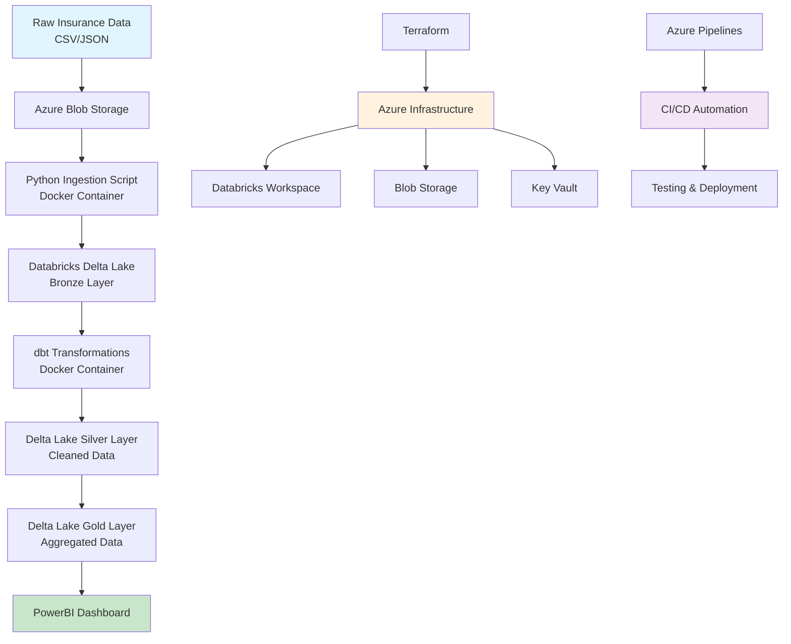

# Hiscox Insurance Data Engineering ETL Pipeline

A complete, cloud-native ETL pipeline designed for processing insurance data using modern data engineering practices. This project demonstrates proficiency in Docker, Terraform, dbt, Databricks, Azure Pipelines, and DevOps methodologies.

## Architecture Overview



## Project Structure

```
etl-hiscox/
├── terraform/                 # Infrastructure as Code
│   ├── main.tf
│   ├── variables.tf
│   ├── outputs.tf
│   └── terraform.tfvars.example
├── docker/                    # Container configurations
│   ├── python/
│   │   └── Dockerfile
│   └── dbt/
│       └── Dockerfile
├── dbt/                       # Data transformation
│   ├── dbt_project.yml
│   ├── profiles.yml
│   ├── models/
│   │   ├── bronze/
│   │   ├── silver/
│   │   └── gold/
│   ├── tests/
│   └── macros/
├── scripts/                   # Python orchestration
│   ├── ingestion.py
│   ├── orchestrator.py
│   └── utils/
├── data/                      # Sample data
│   ├── raw/
│   └── processed/
├── pipelines/                 # CI/CD configuration
│   └── azure-pipelines.yml
├── docs/                      # Documentation
│   └── architecture.md
├── requirements.txt
├── .gitignore
├── .env.example
└── README.md
```

## Technologies Used

- **Languages**: Python 3.9+, SQL
- **Data Platform**: Azure Databricks, Delta Lake
- **Transformation**: dbt (data build tool)
- **Infrastructure**: Terraform
- **Containerization**: Docker
- **CI/CD**: Azure Pipelines
- **Cloud Provider**: Microsoft Azure
- **Visualization**: PowerBI

## Prerequisites

1. **Azure Subscription** with appropriate permissions
2. **Azure CLI** installed and configured
3. **Terraform** >= 1.0
4. **Docker** >= 20.10
5. **Python** >= 3.9
6. **Git** for version control

## Setup Instructions

### 1. Clone and Setup Environment

```bash
git clone <repository-url>
cd etl-hiscox

# Create virtual environment
python -m venv venv
source venv/bin/activate  # On Windows: venv\Scripts\activate

# Install dependencies
pip install -r requirements.txt
```

### 2. Configure Environment Variables

```bash
cp .env.example .env
# Edit .env with your Azure credentials and configuration
```

### 3. Deploy Infrastructure

```bash
cd terraform
cp terraform.tfvars.example terraform.tfvars
# Edit terraform.tfvars with your specific values

terraform init
terraform plan
terraform apply
```

### 4. Build Docker Images

```bash
# Build Python ingestion container
docker build -t hiscox-etl-python ./docker/python/

# Build dbt transformation container
docker build -t hiscox-etl-dbt ./docker/dbt/
```

### 5. Run Pipeline Locally

```bash
# Run ingestion
python scripts/ingestion.py

# Run dbt transformations
cd dbt
dbt run
dbt test

# Or use orchestrator
python scripts/orchestrator.py
```

## Pipeline Components

### Data Ingestion
- Reads raw insurance data from Azure Blob Storage
- Validates data quality and schema
- Loads data into Databricks Delta Lake (Bronze layer)

### Data Transformation (dbt)
- **Bronze Layer**: Raw data with minimal processing
- **Silver Layer**: Cleaned and validated data
- **Gold Layer**: Business-ready aggregated data

### Data Quality
- dbt tests for data validation
- Schema enforcement
- Business rule validation

### Infrastructure
- Databricks workspace
- Azure Blob Storage
- Azure Key Vault for secrets
- Service Principal for authentication

## CI/CD Pipeline

The Azure Pipeline automatically:
1. Runs code quality checks (linting, formatting)
2. Executes unit tests
3. Builds and pushes Docker images
4. Deploys infrastructure changes
5. Runs dbt tests
6. Deploys to production environment

## Data Model

### Source Data
- **Claims**: claim_id, policy_id, claim_amount, claim_date, claim_type, status
- **Policies**: policy_id, customer_id, policy_type, premium_amount, start_date, end_date

### Transformed Data
- **Silver Layer**: Cleaned claims and policies with data quality validations
- **Gold Layer**: Aggregated metrics for business intelligence

## Monitoring and Logging

- Structured logging throughout the pipeline
- Data quality monitoring with dbt tests
- Pipeline execution monitoring via Azure Monitor

## Security

- Secrets managed via Azure Key Vault
- Service Principal authentication
- Network security groups for Databricks
- Encrypted data at rest and in transit

## Contributing

1. Create feature branch
2. Make changes with appropriate tests
3. Run local validation: `python scripts/validate.py`
4. Submit pull request

## Troubleshooting

### Common Issues

1. **Databricks Connection**: Ensure service principal has proper permissions
2. **dbt Profiles**: Verify profiles.yml configuration matches your environment
3. **Docker Build**: Check Docker daemon is running and you have sufficient resources

### Support

For issues related to:
- Infrastructure: Check Terraform state and Azure resource status
- Data Pipeline: Review logs in `logs/` directory
- dbt Models: Run `dbt debug` to validate configuration

## License

This project is licensed under the MIT License - see the LICENSE file for details.
