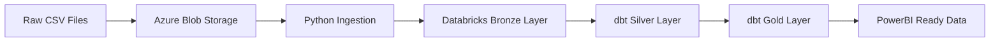

# Hiscox ETL Pipeline - Complete Step-by-Step Walkthrough

This guide provides a detailed explanation of every step, command, and file in the Hiscox ETL pipeline. Follow this to understand exactly what happens at each stage.

## 📋 Table of Contents

1. [Project Overview](#project-overview)
2. [Prerequisites Setup](#prerequisites-setup)
3. [Environment Configuration](#environment-configuration)
4. [Infrastructure Deployment](#infrastructure-deployment)
5. [Docker Container Setup](#docker-container-setup)
6. [Data Pipeline Execution](#data-pipeline-execution)
7. [dbt Transformations](#dbt-transformations)
8. [CI/CD Pipeline](#cicd-pipeline)
9. [Troubleshooting](#troubleshooting)

---

## 1. Project Overview

### What This Pipeline Does


### Key Components
- **Terraform**: Infrastructure as Code for Azure resources
- **Python Scripts**: Data ingestion and orchestration
- **dbt**: Data transformations (Bronze → Silver → Gold)
- **Docker**: Containerized execution environment
- **Azure Pipelines**: CI/CD automation

---

## 2. Prerequisites Setup

### 2.1 Install Required Tools

```bash
# Install Homebrew (if not already installed)
/bin/bash -c "$(curl -fsSL https://raw.githubusercontent.com/Homebrew/install/HEAD/install.sh)"

# Install Azure CLI
  sudo xcodebuild -license accept

# Install Terraform
brew install terraform

# Install Docker Desktop
# Download from: https://www.docker.com/products/docker-desktop
# Or install via Homebrew Cask:
brew install --cask docker

# Alternative: Install tools manually
# Azure CLI: https://docs.microsoft.com/en-us/cli/azure/install-azure-cli-macos
# Terraform: https://developer.hashicorp.com/terraform/downloads

# Verify installations
az --version
terraform --version
docker --version
python3 --version
```

### 2.2 Azure Authentication

```bash
# Login to Azure
az login

# Set your subscription (replace with your subscription ID)
az account set --subscription "your-subscription-id"

# Verify current subscription
az account show
```

**What this does**: Authenticates your local machine with Azure and sets the active subscription for resource deployment.

---

## 3. Environment Configuration

### 3.1 Create Python Virtual Environment

```bash
# Navigate to project directory
cd /Users/aniketmajety/Documents/etl-hiscox

# Create virtual environment
python3 -m venv venv

# Activate virtual environment
source venv/bin/activate  # On macOS/Linux
# venv\Scripts\activate   # On Windows

# Install Python dependencies
pip install -r requirements.txt
```

**Files involved**:
- `requirements.txt`: Contains all Python packages needed (pandas, azure-sdk, dbt, etc.)

### 3.2 Configure Environment Variables

```bash
# Copy environment template
cp .env.example .env

# Edit the .env file with your specific values
open -e .env  # Opens in TextEdit, or use: code .env (VS Code), vim .env, etc.
```

**File: `.env`** - You need to update these values:
```bash
# Azure Configuration
AZURE_SUBSCRIPTION_ID=your-actual-subscription-id
AZURE_TENANT_ID=your-actual-tenant-id

# Storage (will be created by Terraform, but you can customize names)
AZURE_STORAGE_ACCOUNT_NAME=sthiscoxetldev001

# Databricks (will be populated after Terraform deployment)
DATABRICKS_HOST=adb-1234567890123456.16.azuredatabricks.net
DATABRICKS_TOKEN=your-databricks-token
```

**What this does**: Sets up environment variables that the Python scripts and dbt will use to connect to Azure services.

---

## 4. Infrastructure Deployment

### 4.1 Understand Terraform Files

Before running commands, let's understand what each Terraform file does:

#### `terraform/main.tf`
- **Purpose**: Defines all Azure resources to be created

**Resources Created and Why You Need Them**:

1. **Resource Group** (`azurerm_resource_group`)
   - **What it is**: A container that holds all your Azure resources
   - **Why you need it**: Groups everything together for easy management and billing
   - **Real purpose**: Like a folder for all your cloud stuff - delete the folder, everything inside gets deleted

2. **Storage Account with Data Lake Gen2** (`azurerm_storage_account`)
   - **What it is**: Cloud storage that can handle massive amounts of data
   - **Why you need it**: Stores your raw CSV files, processed data, and logs
   - **Real purpose**: Think of it as a massive hard drive in the cloud that can handle big data operations

3. **Storage Containers** (raw-data, processed-data, logs)
   - **What they are**: Folders inside your storage account
   - **Why you need them**: Organize different types of data
   - **Real purpose**: 
     - `raw-data`: Where your original CSV files go
     - `processed-data`: Where cleaned/transformed data goes
     - `logs`: Where error logs and pipeline execution logs are stored

4. **Key Vault** (`azurerm_key_vault`)
   - **What it is**: Secure storage for passwords, API keys, and secrets
   - **Why you need it**: Stores database passwords, API tokens safely
   - **Real purpose**: Instead of hardcoding passwords in your code (bad!), you store them here securely

5. **Databricks Workspace** (`azurerm_databricks_workspace`)
   - **What it is**: A cloud platform for running big data analytics
   - **Why you need it**: Processes your insurance data using Apache Spark
   - **Real purpose**: Like having a supercomputer that can process millions of insurance claims quickly

6. **Databricks Cluster** (`databricks_cluster`)
   - **What it is**: The actual computing power (virtual machines) that run your data processing
   - **Why you need it**: Executes your Python and SQL code on large datasets
   - **Real purpose**: The "engine" that actually crunches your data - can scale up/down based on workload

7. **Container Registry** (`azurerm_container_registry`)
   - **What it is**: Storage for your Docker images
   - **Why you need it**: Stores the packaged versions of your Python scripts and dbt models
   - **Real purpose**: Like Docker Hub but private - stores your custom-built containers

8. **Log Analytics Workspace** (`azurerm_log_analytics_workspace`)
   - **What it is**: Centralized logging and monitoring service
   - **Why you need it**: Tracks pipeline performance, errors, and usage
   - **Real purpose**: Your "mission control" - see what's working, what's broken, and how fast things are running

#### `terraform/variables.tf`
- **Purpose**: Defines input variables with defaults and validation rules
- **Key Variables**:
  - `storage_account_name`: Must be globally unique, 3-24 chars, lowercase
  - `key_vault_name`: Must be globally unique, 3-24 chars
  - `databricks_workspace_name`: Name for your Databricks workspace
  - `location`: Azure region (default: "East US")

#### `terraform/outputs.tf`
- **Purpose**: Defines what information Terraform will display after deployment
- **Key Outputs**: Storage account names, Databricks URLs, Key Vault URIs

### 4.2 Configure Terraform Variables

```bash
cd terraform

# Copy the example variables file
cp terraform.tfvars.example terraform.tfvars

# Edit with your specific values
open -e terraform.tfvars  # Opens in TextEdit, or use: code terraform.tfvars (VS Code), vim terraform.tfvars, etc.
```

**File: `terraform/terraform.tfvars`** - Update these values:
```hcl
# Make these globally unique by adding your initials or random numbers
storage_account_name = "sthiscoxetldev001am"  # Add your initials
key_vault_name = "kv-hiscox-etl-dev-001-am"   # Add your initials
container_registry_name = "acrhiscoxetldev001am"  # Add your initials

# Customize other values as needed
location = "East US"  # or your preferred region
```

### 4.3 Deploy Infrastructure Step-by-Step

#### Step 1: Initialize Terraform
```bash
terraform init
```

**What this does**:
- Downloads the Azure provider plugins
- Creates `.terraform/` directory with provider binaries
- Initializes the backend for state management
- **Files created**: `.terraform/`, `.terraform.lock.hcl`

#### Step 2: Plan the Deployment
```bash
terraform plan
```

**What this does**:
- Reads your `main.tf`, `variables.tf`, and `terraform.tfvars`
- Connects to Azure to check current state
- Shows you exactly what resources will be created/modified/destroyed
- **No resources are created yet** - this is just a preview

**Expected output**: You should see a plan showing ~15-20 resources to be created, including:
- 1 Resource Group
- 1 Storage Account + 3 Containers
- 1 Key Vault + 2 Secrets
- 1 Databricks Workspace + 1 Cluster
- 1 Container Registry
- 1 Log Analytics Workspace

#### Step 3: Apply the Configuration
```bash
terraform apply
```

**What this does**:
- Shows the plan again and asks for confirmation
- Type `yes` to proceed
- Creates all Azure resources as defined in `main.tf`
- Stores the state in `terraform.tfstate`
- **Duration**: 10-15 minutes (Databricks workspace takes the longest)

**Files created/updated**:
- `terraform.tfstate`: Current state of your infrastructure
- `terraform.tfstate.backup`: Previous state backup

#### Step 4: Capture Important Outputs
```bash
# Get all outputs
terraform output

# Get specific outputs for your .env file
terraform output databricks_workspace_url
terraform output storage_account_name
terraform output key_vault_uri
```

**What to do with outputs**: Update your `.env` file with the actual values from Terraform outputs.

---

## 5. Docker Container Setup

### 5.1 Understand Docker Files

#### `docker/python/Dockerfile`
- **Base Image**: `python:3.9-slim`
- **Installs**: Java (for PySpark), Python packages from requirements.txt
- **Copies**: Python scripts, data files
- **Security**: Creates non-root user `appuser`
- **Entry Point**: `scripts/orchestrator.py`

#### `docker/dbt/Dockerfile`
- **Base Image**: `ghcr.io/dbt-labs/dbt-databricks:1.6.0`
- **Installs**: Additional Azure packages
- **Copies**: dbt project files
- **Security**: Creates non-root user `dbtuser`
- **Entry Point**: `dbt run`

#### `docker-compose.yml`
- **Services**: etl-python, etl-dbt, localstack (for local dev)
- **Networks**: Creates isolated network for containers
- **Volumes**: Mounts local directories for development

### 5.2 Build Docker Images

```bash
# Return to project root
cd /Users/aniketmajety/Documents/etl-hiscox

# Build Python ETL container
docker build -t hiscox-etl-python ./docker/python/
```

**What this does**:
- Reads `docker/python/Dockerfile`
- Downloads base Python image
- Installs system dependencies (Java, build tools)
- Installs Python packages from `requirements.txt`
- Copies your scripts and data
- Creates the image tagged as `hiscox-etl-python`

```bash
# Build dbt container
docker build -t hiscox-etl-dbt ./docker/dbt/
```

**What this does**:
- Reads `docker/dbt/Dockerfile`
- Downloads dbt-databricks base image
- Installs additional Azure packages
- Copies your dbt project files
- Creates the image tagged as `hiscox-etl-dbt`

### 5.3 Verify Docker Images

```bash
# List your built images
docker images | grep hiscox

# Test Python container
docker run --rm hiscox-etl-python python --version

# Test dbt container
docker run --rm hiscox-etl-dbt dbt --version
```

---

## 6. Data Pipeline Execution

### 6.1 Understand Python Scripts

#### `scripts/utils/config.py`
- **Purpose**: Centralized configuration management
- **Reads**: Environment variables from `.env`
- **Provides**: Database connections, storage URLs, validation

#### `scripts/utils/logger.py`
- **Purpose**: Structured logging setup
- **Features**: JSON logging, file rotation, performance metrics
- **Output**: Logs to both console and `logs/` directory

#### `scripts/ingestion.py`
- **Purpose**: Ingests raw CSV data into Databricks Delta Lake
- **Process**:
  1. Initializes Spark session with Delta Lake support
  2. Connects to Azure Blob Storage
  3. Reads CSV files from `data/raw/`
  4. Adds metadata columns (ingestion timestamp, batch ID)
  5. Removes duplicates based on primary keys
  6. Writes to Delta tables in Bronze layer

#### `scripts/orchestrator.py`
- **Purpose**: Coordinates the entire ETL pipeline
- **Steps**:
  1. Runs data ingestion
  2. Executes dbt transformations
  3. Performs data quality checks
  4. Generates execution report

### 6.2 Prepare Sample Data

The pipeline includes sample data in `data/raw/`:

#### `data/raw/sample_claims.csv`
- **Records**: 15 insurance claims
- **Fields**: claim_id, policy_id, customer_id, claim_amount, claim_date, etc.
- **Types**: AUTO, HOME, LIFE, HEALTH, BUSINESS claims

#### `data/raw/sample_policies.csv`
- **Records**: 15 insurance policies
- **Fields**: policy_id, customer_id, policy_type, premium_amount, etc.
- **Types**: AUTO, HOME, LIFE, HEALTH, BUSINESS policies

### 6.3 Upload Sample Data to Azure

```bash
# Upload sample data to blob storage (replace with your storage account name)
az storage blob upload-batch \
  --destination raw-data \
  --source data/raw/ \
  --account-name sthiscoxetldev001am \
  --auth-mode login
```

**What this does**:
- Uploads all CSV files from `data/raw/` to the `raw-data` container
- Uses your Azure login credentials for authentication
- Files will be available at: `https://yourstorageaccount.blob.core.windows.net/raw-data/`

### 6.4 Run Data Ingestion

```bash
# Run ingestion script directly
python scripts/ingestion.py
```

**What happens**:
1. **Config Loading**: Reads `.env` file for Azure credentials
2. **Spark Initialization**: Creates Spark session with Delta Lake extensions
3. **Blob Connection**: Connects to Azure Blob Storage
4. **Data Reading**: Reads CSV files from blob storage
5. **Data Processing**: Adds metadata, removes duplicates
6. **Delta Writing**: Writes to Databricks Delta Lake tables
7. **Logging**: Records metrics and any errors

**Expected Output**:
```
✅ Spark session initialized successfully
✅ Blob storage client initialized successfully
📊 Initial record count: 15
✅ Successfully ingested 15 claims records to hiscox_etl_dev_bronze.claims
✅ Successfully ingested 15 policies records to hiscox_etl_dev_bronze.policies
✅ Data ingestion completed successfully
```

---

## 7. dbt Transformations

### 7.1 Understand dbt Project Structure

#### `dbt/dbt_project.yml`
- **Purpose**: Main dbt project configuration
- **Defines**: Model materialization, file formats, variables
- **Layers**: Bronze (raw), Silver (cleaned), Gold (aggregated)

#### `dbt/profiles.yml`
- **Purpose**: Database connection configuration
- **Environments**: dev, staging, prod
- **Connection**: Uses Databricks SQL warehouse

#### `dbt/models/sources.yml`
- **Purpose**: Defines source data tables and tests
- **Sources**: Raw claims and policies tables
- **Tests**: Data quality checks (unique, not_null, accepted_values)

### 7.2 dbt Model Layers

#### Bronze Layer (`dbt/models/bronze/`)
- **Purpose**: Raw data with minimal processing
- **Files**:
  - `bronze_claims.sql`: Raw claims with metadata
  - `bronze_policies.sql`: Raw policies with metadata
- **Materialization**: Delta tables

#### Silver Layer (to be created)
- **Purpose**: Cleaned and validated data
- **Transformations**: Data type fixes, validation, standardization

#### Gold Layer (to be created)
- **Purpose**: Business-ready aggregated data
- **Outputs**: Summary tables for PowerBI

### 7.3 Run dbt Transformations

```bash
# Navigate to dbt directory
cd dbt

# Install dbt dependencies (if any packages are defined)
dbt deps --profiles-dir . --project-dir .
```

**What this does**:
- Installs any dbt packages defined in `packages.yml`
- Creates `dbt_packages/` directory

```bash
# Parse and validate dbt models
dbt parse --profiles-dir . --project-dir .
```

**What this does**:
- Validates SQL syntax in all models
- Checks for circular dependencies
- Validates source and model references

```bash
# Run dbt models
dbt run --profiles-dir . --project-dir .
```

**What happens**:
1. **Connection**: Connects to Databricks using credentials from `.env`
2. **Compilation**: Compiles Jinja templates into SQL
3. **Execution**: Runs SQL against Databricks in dependency order
4. **Materialization**: Creates Delta tables for each model

**Expected Output**:
```
Running with dbt=1.6.0
Found 2 models, 0 tests, 0 snapshots, 0 analyses, 0 macros, 0 operations, 0 seed files, 2 sources

Completed successfully
Done. PASS=2 WARN=0 ERROR=0 SKIP=0 TOTAL=2
```

```bash
# Run dbt tests
dbt test --profiles-dir . --project-dir .
```

**What this does**:
- Runs all tests defined in `sources.yml` and model files
- Validates data quality (uniqueness, not null, accepted values)
- Reports any test failures

### 7.4 Generate dbt Documentation

```bash
# Generate documentation
dbt docs generate --profiles-dir . --project-dir .

# Serve documentation locally
dbt docs serve --profiles-dir . --project-dir . --port 8080
```

**What this creates**:
- Interactive documentation website
- Data lineage graphs
- Model and column descriptions
- Access at: `http://localhost:8080`

---

## 8. Complete Pipeline Orchestration

### 8.1 Run Full Pipeline

```bash
# Return to project root
cd /Users/aniketmajety/Documents/etl-hiscox

# Run complete pipeline
python scripts/orchestrator.py
```

**What happens**:
1. **Ingestion Step**: Runs `scripts/ingestion.py`
2. **Transformation Step**: Runs dbt commands
3. **Quality Checks**: Validates data quality
4. **Reporting**: Generates execution summary

**Expected Output**:
```
🎯 Starting Hiscox ETL Pipeline Orchestration
🚀 Starting data ingestion step
✅ Data ingestion completed successfully
🔄 Starting dbt transformations
✅ dbt transformations completed successfully
✅ dbt tests passed successfully
🔍 Starting data quality checks
✅ Data quality checks completed

╔══════════════════════════════════════════════════════════════════════════════╗
║                        HISCOX ETL PIPELINE REPORT                           ║
╠══════════════════════════════════════════════════════════════════════════════╣
║ Pipeline Start Time: 2024-10-21 10:30:00                                    ║
║ Pipeline End Time:   2024-10-21 10:35:00                                    ║
║ Total Duration:      0:05:00                                                ║
║                                                                              ║
║ STEP RESULTS:                                                                ║
║ • Data Ingestion:     ✅ SUCCESS                                            ║
║ • dbt Transformations: ✅ SUCCESS                                           ║
║ • Data Quality:       ✅ SUCCESS                                            ║
║                                                                              ║
║ Overall Status:       ✅ SUCCESS                                            ║
╚══════════════════════════════════════════════════════════════════════════════╝

🎉 Hiscox ETL Pipeline completed successfully!
```

---

## 9. CI/CD Pipeline

### 9.1 Understand Azure Pipeline

#### `pipelines/azure-pipelines.yml`
- **Triggers**: Runs on commits to main/develop branches
- **Stages**:
  1. **Validate**: Code quality, Terraform validation, dbt parsing
  2. **Build**: Docker image building and pushing to ACR
  3. **Deploy Infrastructure**: Terraform apply
  4. **Deploy ETL**: Upload data and deploy pipeline
  5. **Test**: Integration testing

### 9.2 Pipeline Stages Explained

#### Stage 1: Validate
```yaml
- script: black --check scripts/ --diff
- script: flake8 scripts/ --max-line-length=88
- script: terraform validate
- script: dbt parse
```

**What this does**: Ensures code quality and validates configurations before deployment.

#### Stage 2: Build
```yaml
- task: Docker@2
  inputs:
    command: 'build'
    Dockerfile: 'docker/python/Dockerfile'
```

**What this does**: Builds Docker images and pushes to Azure Container Registry.

#### Stage 3: Deploy Infrastructure
```yaml
- script: terraform apply tfplan
```

**What this does**: Deploys/updates Azure infrastructure using Terraform.

#### Stage 4: Deploy ETL
```yaml
- script: az storage blob upload-batch --destination raw-data --source data/raw/
```

**What this does**: Uploads sample data and deploys pipeline components.

#### Stage 5: Test
```yaml
- script: python scripts/orchestrator.py
```

**What this does**: Runs end-to-end integration tests.

---

## 10. Troubleshooting

### 10.1 Common Issues and Solutions

#### Terraform Issues

**Issue**: "Storage account name already exists"
```bash
Error: A resource with the ID already exists
```
**Solution**: Update `storage_account_name` in `terraform.tfvars` to be globally unique.

**Issue**: "Insufficient permissions"
```bash
Error: authorization failed
```
**Solution**: Ensure your Azure account has Contributor role on the subscription.

#### Docker Issues

**Issue**: "Docker daemon not running"
```bash
Error: Cannot connect to the Docker daemon
```
**Solution**: Start Docker Desktop application.

**Issue**: "Build context too large"
```bash
Error: build context is too large
```
**Solution**: Add more patterns to `.dockerignore` file.

#### Python/dbt Issues

**Issue**: "Module not found"
```bash
ModuleNotFoundError: No module named 'azure'
```
**Solution**: Activate virtual environment and reinstall requirements:
```bash
source venv/bin/activate
pip install -r requirements.txt
```

**Issue**: "Databricks connection failed"
```bash
Error: Could not connect to Databricks
```
**Solution**: 
1. Verify `DATABRICKS_HOST` and `DATABRICKS_TOKEN` in `.env`
2. Check Databricks workspace is running
3. Verify network connectivity

### 10.2 Verification Commands

```bash
# Check Azure resources
az resource list --resource-group rg-hiscox-etl-dev --output table

# Check Docker images
docker images | grep hiscox

# Check Python environment
pip list | grep -E "(azure|databricks|dbt)"

# Check dbt connection
cd dbt && dbt debug --profiles-dir . --project-dir .

# Check logs
ls -la logs/
tail -f logs/hiscox_etl_$(date +%Y%m%d).log
```

### 10.3 Cleanup Commands

```bash
# Stop and remove Docker containers
docker-compose down

# Remove Docker images
docker rmi hiscox-etl-python hiscox-etl-dbt

# Destroy Terraform infrastructure (BE CAREFUL!)
cd terraform && terraform destroy

# Clean Python environment
deactivate
rm -rf venv/
```

---

## 🎯 Summary

This walkthrough covered:

1. **Infrastructure**: How Terraform creates Azure resources
2. **Containerization**: How Docker packages the application
3. **Data Pipeline**: How Python scripts ingest and process data
4. **Transformations**: How dbt transforms data through Bronze/Silver/Gold layers
5. **Orchestration**: How the complete pipeline runs end-to-end
6. **CI/CD**: How Azure Pipelines automates deployment and testing

Each command and file has been explained with its purpose, inputs, outputs, and expected results. You now have a complete understanding of the entire Hiscox ETL pipeline! 🚀
